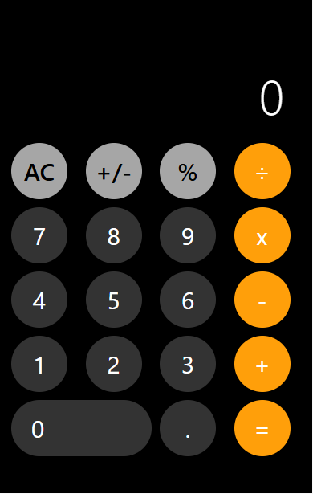

# 📱 iPhone Calculator Clone

A responsive and visually accurate clone of the iPhone calculator built with **HTML**, **CSS**, and **JavaScript**. Designed to showcase my front-end skills in replicating real-world user interfaces and core JavaScript logic.



---

## ✨ Features

- ✅ Real-time arithmetic operations (addition, subtraction, multiplication, division)
- ✅ Smooth click and keyboard input handling
- ✅ Clean, iOS-inspired layout
- ✅ Responsive design for all screen sizes
- ✅ Visual feedback on active buttons

---

## 🧰 Technologies Used

- HTML5 for structure  
- CSS3 for styling and responsiveness  
- Vanilla JavaScript for logic and interactivity

---

## 📂 How to Use

Clone the project and open it in your browser:

```bash
git clone https://github.com/Kontractour/iphone-calculator-clone.git
cd iphone-calculator-clone
Then open index.html in your preferred browser.

🧑‍💻 About Me
Godswill Okereke
Frontend Developer | Content Creator | JavaScript Enthusiast
🔗 GitHub: @Kontractour

📄 License
This project is open-source under the MIT License. You’re free to use, modify, and share with credit.

📝 Acknowledgment
Inspired by the original iOS calculator interface. Built purely for educational and portfolio purposes.
